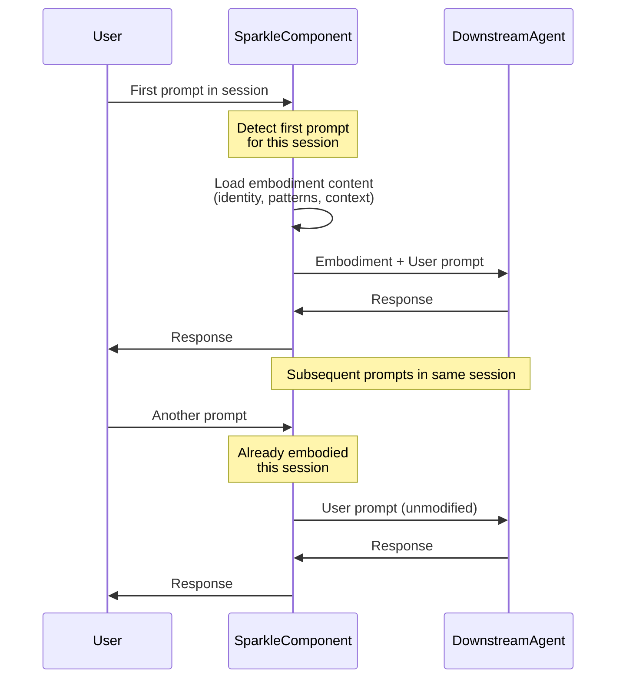

# ACP Component

Sparkle can run as an ACP (Agent Communication Protocol) component, enabling it to be composed with other agents in proxy chains. This deployment mode automatically injects Sparkle's embodiment on the first prompt of each session while transparently passing through all other agent interactions.

## What is ACP Component Mode?

ACP component mode allows Sparkle to function as middleware in agent composition chains. Instead of running as a standalone MCP server, Sparkle intercepts and enhances prompts before forwarding them to downstream agents.

**Key capabilities:**
- **Automatic embodiment injection** - The first prompt in each session includes full Sparkle identity and patterns
- **Transparent proxying** - All other messages pass through unmodified
- **Tool composition** - Sparkle MCP tools are available to downstream agents
- **Session tracking** - Embodiment happens once per session, not on every prompt

## Running in ACP Mode

Start Sparkle as an ACP component:

```bash
sparkle-mcp --acp
```

This launches Sparkle as a component that can be composed with other agents using the ACP protocol.

## How It Works

When running in ACP mode, Sparkle intercepts `PromptRequest` messages to inject embodiment content on the first prompt of each session:



## Architecture

The `SparkleComponent` implements the `sacp::Component` trait, which defines how components handle messages in an ACP chain:

- **Message interception**: Monitors `PromptRequest` messages to detect session boundaries
- **Session tracking**: Maintains a set of embodied session IDs to ensure one-time injection
- **Embodiment loading**: Uses `SparkleEmbodiment::load()` to get the full identity and patterns
- **Content injection**: Prepends embodiment to the user's first prompt in each session
- **Tool registry**: Provides Sparkle MCP tools via `McpServiceRegistry` to downstream agents

## Use Cases

**Agent composition chains:**
```
User → SparkleComponent → CustomToolAgent → BaseModel
```

**Multi-agent collaboration:**
```
User → SparkleComponent → SpecialistAgentA → SpecialistAgentB
```

The ACP component model enables flexible agent architectures where Sparkle's collaboration patterns enhance other agent capabilities.

## Technical Details

The implementation lives in `sparkle-mcp/src/acp_component.rs` and integrates with:
- `sacp` - Core ACP protocol implementation
- `sacp-proxy` - Proxy utilities for message forwarding
- `SparkleEmbodiment` - Loads identity, patterns, and context

For deployment and integration details, see the [Integration Guide](../integration/getting-started.md).
